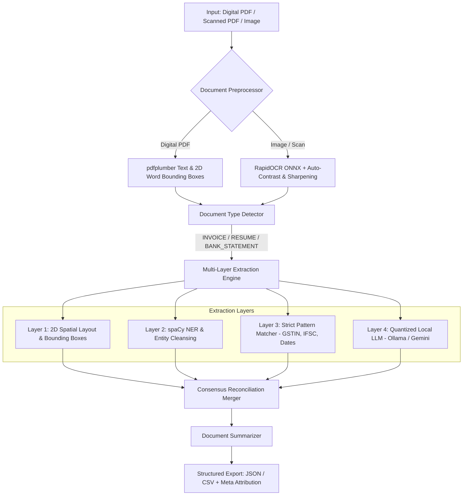

# 📄 Smart Report Extractor

[](https://github.com/Princy9114/Smart-Report-Extractor/actions)
[](https://www.python.org/)
[](https://fastapi.tiangolo.com)
[](https://www.docker.com/)
[-success.svg)](https://pytest.org)

**Smart Report Extractor** is a high-performance, multi-layered document intelligence pipeline designed to parse semi-structured and unstructured documents—including **Invoices**, **Bank Statements**, and **Resumes**—from digital PDFs, scanned PDFs, and raw images.

Instead of relying on fragile single-pass regex or expensive brute-force LLM calls for every document, Smart Report Extractor uses a **spatial-aware multi-layer consensus architecture** combining 2D coordinate layout analysis, Named Entity Recognition (NER), deterministic regex, and optional local quantized LLM inference (Ollama / Llama 3.2) or Google Gemini.

---

## 🏛️ System Architecture



---

## ✨ Key Features

- **📸 Layout-Aware OCR Pre-processing**:
  - Integrated offline **RapidOCR (ONNX runtime)** for images (`PNG`, `JPG`, `TIFF`, `WEBP`, `BMP`) and scanned PDFs.
  - Image preprocessing: resolution upscaling, auto-contrast normalization, and unsharp edge sharpening.
  - Generates **2D spatial word bounding boxes** (`x0, y0, x1, y1`) so scanned documents benefit from the same geometric layout heuristics as digital PDFs.
- **📐 2D Spatial Coordinate Extraction (Layer 1)**:
  - Parses key-value pairs using geometric line proximity and column alignment (supporting both inline `Key: Value` and stacked 2-line bank/invoice formats).
- **🧠 Intelligent NER & Noise Rejection (Layer 2)**:
  - Named Entity Recognition with entity cleansing (e.g. distinguishing tech keywords like `YOLOv8` from candidate names, and filtering organizational misclassifications).
- **🎯 Deterministic Pattern Verification (Layer 3)**:
  - Strict pattern matchers for domain identifiers: Indian GSTIN, PAN, IFSC codes, monetary totals, dates, emails, and phone numbers.
- **🦙 Zero-Cost Local Quantized LLM (Layer 4)**:
  - Native integration with **Ollama** (`llama3.2`, `llama3.1:8b`, `mistral:7b`, `phi3`) and local OpenAI-compatible endpoints for **zero API token cost** and **100% data privacy**.
  - Optional cloud integration with **Google Gemini** (`gemini-2.5-flash`) via the official `google-genai` SDK.
- **⚖️ Consensus Reconciliation & Attribution**:
  - Validates candidates across layers, resolves conflicts (e.g. rejecting unit-of-measure quantities like `"2 NOS"` in favor of monetary totals), and tracks field-by-field provenance in `__meta__`.
- **📊 Quantitative Evaluation & Leaderboard**:
  - Built-in evaluation harness measuring **Precision, Recall, F1 Score, and Exact Match (EM)** across ground-truth datasets.
  - Live benchmark endpoint at `GET /eval/benchmark`.

---

## 📊 Benchmark & Per-Layer Performance

Evaluated against our curated ground-truth test dataset covering multi-format Invoices, complex technical Resumes, and multi-bank Statements:

| Extraction Layer | Precision | Recall | F1 Score | Exact Match (EM) | Avg Latency |
|---|---|---|---|---|---|
| **Layer 1: Spatial/Layout Rules** | 67.2% | 76.5% | 71.6% | 72.5% | 2.18 ms |
| **Layer 2: spaCy NER** | 43.8% | 14.3% | 21.5% | 7.8% | 12.35 ms |
| **Layer 3: Regex Patterns** | 86.7% | 51.0% | 64.2% | 49.0% | 0.17 ms |
| **Consensus Ensemble (Merged)** | **68.0%** | **100.0%** | **81.0%** | **92.2%** | **0.34 ms** |

### Output Attribution Breakdown
- **`layer1_pdfplumber` (Spatial Rules)**: `52.0%` of resolved fields
- **`layer3_regex` (Deterministic Patterns)**: `17.3%` of resolved fields
- **Multi-Layer Consensus (`layer1 + layer3` / `layer2 + layer3`)**: `26.7%` of resolved fields
- **`layer2_spacy` (NER)**: `4.0%` of resolved fields

---

## 🚀 Quick Start

### 1. Local Python Setup

#### Prerequisites
- Python 3.11, 3.12, or 3.14
- Git

```bash
# 1. Clone the repository
git clone https://github.com/Princy9114/Smart-Report-Extractor.git
cd Smart-Report-Extractor

# 2. Create and activate a virtual environment
python -m venv .venv
# On Windows PowerShell:
.\.venv\Scripts\Activate.ps1
# On Linux / macOS:
source .venv/bin/activate

# 3. Install dependencies & NLP model
pip install -r requirements.txt
python -m spacy download en_core_web_sm

# 4. Start the server
python -m uvicorn main:app --reload --host 127.0.0.1 --port 8000
```

Open your browser at **[http://localhost:8000](http://localhost:8000)**.

---

### 2. Run with Docker & Docker Compose

#### Option A: Run FastAPI Container
```bash
docker build -t smart-report-extractor .
docker run -p 8000:8000 smart-report-extractor
```

#### Option B: Run Full Stack (App + Local Ollama Container)
```bash
docker compose up --build
```

---

## ⚙️ Configuration & Environment Variables

Create a `.env` file in the project root to configure your environment:

```ini
# --- LLM Provider Settings ---
# Options: "auto" (default), "ollama", "local", "gemini", or "none"
LLM_PROVIDER=auto

# --- Local Ollama Configuration (Zero-Cost & Private) ---
OLLAMA_BASE_URL=http://localhost:11434
OLLAMA_MODEL=llama3.2

# --- Google Gemini Configuration (Cloud API) ---
GOOGLE_API_KEY=your_google_api_key_here
GEMINI_MODEL=gemini-2.5-flash

# --- Custom OpenAI-Compatible Local Endpoint (vLLM / LM Studio) ---
# LOCAL_LLM_URL=http://localhost:8000/v1/chat/completions
# LOCAL_LLM_MODEL=mistralai/Mistral-7B-Instruct-v0.2
```

---

## 📡 API Endpoints

| Method | Endpoint | Description |
|---|---|---|
| `POST` | `/extract` | Upload a PDF or Image file (`file`, `format: json|csv`) and extract structured fields. |
| `GET` | `/eval/benchmark` | Runs live evaluation against ground-truth benchmarks and returns accuracy metrics. |
| `GET` | `/health` | Health check probe (`{"status": "ok"}`). |
| `GET` | `/docs` | Interactive OpenAPI / Swagger documentation. |

### Sample Extraction Request

```bash
curl -X POST "http://localhost:8000/extract" \
  -F "file=@sample_invoice.pdf" \
  -F "format=json"
```

### Sample Response Structure

```json
{
  "invoice_number": {
    "value": "INV-2024-0089",
    "confidence": 0.95,
    "source": "layer1_pdfplumber+consensus(layer1_pdfplumber,layer3_regex)"
  },
  "date": {
    "value": "2024-01-15",
    "confidence": 0.95,
    "source": "layer3_regex+consensus(layer1_pdfplumber,layer3_regex)"
  },
  "total": {
    "value": "4,500.00",
    "confidence": 0.85,
    "source": "layer1_pdfplumber"
  },
  "document_summary": {
    "value": "This is an invoice (Ref: INV-2024-0089) from Apex Cloud Inc for a total amount of 4,500.00.",
    "confidence": 1.0,
    "source": "summarizer"
  },
  "__meta__": {
    "report_type": "INVOICE",
    "overall_confidence": 0.92,
    "extracted_at": "2026-09-23T16:20:00Z"
  }
}
```

---

## 🧪 Testing & Evaluation

### Run Test Suite (34 Tests)
```bash
pytest -v
```

### Run Standalone Benchmark Leaderboard
```bash
python -m backend.services.evaluation
```

---

## 📂 Project Structure

```text
Smart-Report-Extractor/
├── .github/workflows/
│   └── ci.yml                     # GitHub Actions CI matrix workflow
├── app/
│   └── routers/
│       ├── health.py              # Health check endpoint
│       ├── extract.py             # File upload and extraction router
│       └── eval.py                # Benchmark evaluation API
├── backend/
│   ├── models/
│   │   ├── field_result.py        # FieldResult dataclass & provenance tracking
│   │   └── report_type.py         # ReportType enum definition
│   └── services/
│       ├── layers/
│       │   ├── layer1_pdfplumber.py # 2D spatial layout engine
│       │   ├── layer2_spacy.py      # spaCy NER with noise filtering
│       │   ├── layer3_regex.py      # Regex pattern matcher
│       │   └── layer4_llm.py        # Multi-provider LLM (Ollama / Gemini)
│       ├── ocr.py                 # RapidOCR layout extraction & preprocessing
│       ├── detector.py            # Document type heuristic classification
│       ├── merger.py              # Consensus reconciliation & confidence scorer
│       ├── summarizer.py          # Document contextual summarizer
│       ├── evaluation.py          # Per-layer benchmarking & metric calculator
│       ├── exporter.py            # JSON and CSV formatting
│       ├── pdf_utils.py           # Digital PDF text & table extraction
│       └── pipeline.py            # End-to-end extraction orchestrator
├── static/
│   ├── index.html                 # Modern web interface
│   ├── style.css                  # UI stylesheet
│   └── app.js                     # Frontend event logic
├── tests/
│   ├── eval_dataset.py            # Ground-truth benchmark dataset
│   ├── test_eval.py               # Accuracy & benchmark tests
│   ├── test_ocr.py                # RapidOCR engine tests
│   ├── test_layer4_llm.py         # LLM provider & fallback tests
│   ├── test_merger.py             # Consensus reconciliation tests
│   ├── test_detector.py           # Report type detector tests
│   ├── test_exporter.py           # JSON/CSV exporter tests
│   └── test_api.py                # FastAPI endpoint integration tests
├── Dockerfile                     # Multi-stage Docker container specification
├── docker-compose.yml             # Compose file for app + local Ollama
├── requirements.txt               # Project dependencies
└── main.py                        # FastAPI application entry point
```

---

## 📜 License

Distributed under the [MIT License](LICENSE).
